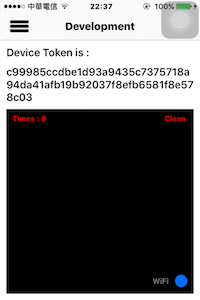
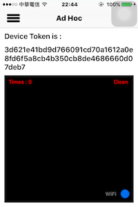

此 repo 從 [php_push_ios_gcm](https://github.com/jhaoheng/php_push_ios_gcm) 切割而來

## USE KIT

- [AFNetworking 3.0](http://cocoadocs.org/docsets/AFNetworking/3.0.4/)
- [slideMenu](https://github.com/jhaoheng/slideMenu_ios)

## Feature

1. 查看目前 ipa 的版本為
	- developement
	- Ad-Hoc
	- App Store
	- Enterprise
2. 查看 token
3. 寄送 token
4. 接收 push

## view

