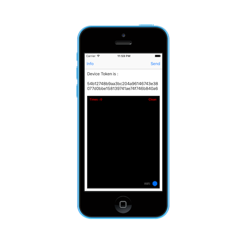
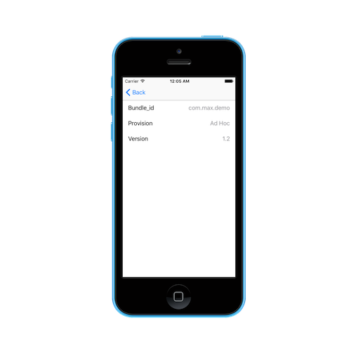
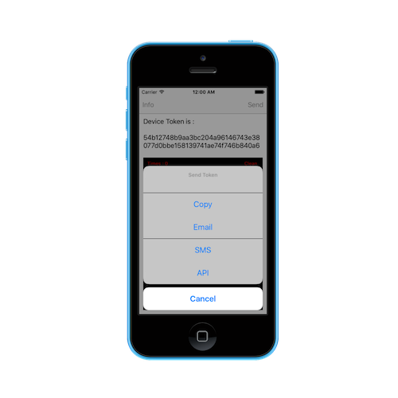

## Readme

- 此 repo 從 [php_push_ios_gcm](https://github.com/jhaoheng/php_push_ios_gcm) 切割而來
- 可與 [APNS_cer_build](https://github.com/jhaoheng/APNS_cer_build) 搭配測試使用
- 目的 : 透過 app 檢查憑證與 token 之間是否正確配對，並可傳送

## USE KIT

- [AFNetworking 3.0](http://cocoadocs.org/docsets/AFNetworking/3.0.4/)

## Feature

1. info
	- bundle_id
	- ver
	- show Porvision
		- development
		- Ad-Hoc
		- App Store
		- Enterprise
2. send token
	- copy
	- email
	- sms
	- api (need use run nodejs server, see repo package `nodejs_rest`)
3. see Notificaion info

## view

### main view

### info view

### send view
